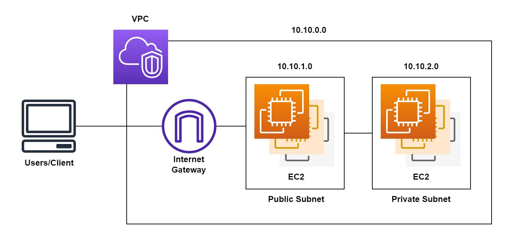

# **AWS VPC**

Before started you need to plan the network architecture like:
+ How many IPs?
+ How many subnet to be created?
+ Which availability region and zones should be used this VPC?

What is VPC (Virtual Private Cloud)? VPC is a virtual network that can be crated in public cloud when you have AWS account with sufficient access. It's logically isolated from other virtual networks in the bridge area of cloud based in our requirement. So, we must specify:
+ The IP address range for the VPC.
+ Add the subnets.
+ Associate the security groups.
+ Configure the routing tables.

Here's the example archtecture:

## **Create the AWS VPC**

Here are the steps to setup the AWS VPC:

1. Enter to the **VPC** service.
2. Inside the **Virtual private cloud** section, select **Your VPCs** and **Create VPC**.
   + Set the VPC **Name tag** (ex: `rohwid-vpc`).
   + Set the **IPv4 CIDR** block (ex: `10.10.0.0/16`).
   + Select **No IPv6 CIDR Block**.
   + And keep the Tenancy into **Default**.
   + Now, **Create**.

## **Create the Internet Gateway**

The internet gateway was needed to connect the instances to the internet. Here are the steps to setup the Internet gateway for VPC:

3. Inside the **Virtual private cloud** section, select **Internet gateways** and **Create internet gateway**.
   + Set the internet gateway **Name tag** (ex: `rohwid-igw`).
   + Now, **Create**.
   + **Select internet gateway that just created**, **select actions**, and choose **attach to VPC**.
   + Then select the VPC (ex: `rohwid-vpc`) and **Attach**.

## **Create the Subnet**

Here we will define the subnet that will separates the connection, which one is the **Public Subnet** or the one that can connects to the internet and the **Private Subnet** or the one that can't connect to the internet. Here are the steps to setup the Subnets for VPC.

4. Inside the **Virtual private cloud** section, select **Subnets** and **Create subnet**.
   + Set the internet gateway **Name tag** (ex: `Public Subnet`).
   + Select the VPC (ex: `rohwid-vpc`).
   + Select the **Availabillity Zone** of you need to specify it. But let it be or keep in `No preferences` if you don't need to specify.
   + Then, set the range of the **IPv4 CIDR block** and **Create** (ex: `10.10.1.0/24`).
5. Continue to create the `Private Subnet` like the steps for create the `Public Subnet`.
   + Then, set the range of the **IPv4 CIDR block** and **Create** (ex: `10.10.2.0/24`).

## **Create the Route Tables**

By default, when the VPC created, one **route table** and one **network access control list** will be created so you can use this route table. Here are the steps to edit the **Route table**.

6. Inside the **Virtual private cloud** section, select **Route Tables**.
7. Select the **route table** that match with **VPC ID**.
8. Add **Key** and set to `Name`, Add **Value** and set `Public RT`.
9. Now, create the **Private Route Table** by click **Create route table**.
   + Add **Name tag** into `Private RT`.
   + Set the **VPC** by selecting the `VPC ID` that you want to add the new route table.
   + Then, **Create**.
10. Edit the `Public RT` route table to make it routed to the Gateway by select the **Routes** tab and click **Edit routes**.   
    +  Fill the **Destination** column with `0.0.0.0/0` and set the **Target** column into the **internet gateway** (ex: `rohwid-igw`)
    +  And, **Save routes**.
11. Attach the `Public RT` into `Public Subnet` in **Subnet Associations** tab .
    + Click **Edit subnet associations**.
    + Then select the `Public Subnet` (ex: `10.10.1.0/24`).
    + and **Save**.
12. Repeat the step for `Private RT` but use the `Private Subnet`.

There will be a lot of **route table** if you have a lot of VPC. So, just match the **VPC ID** that described in **route table** with **ID** of **VPC** that created or that need to edited.

## **Setting the Security Group**

By default, when the VPC created, one **Security Group** will created so you can use this security group. Here are the steps to edit the **Security Groups**.

13. Inside the **Security** section, select **Security Groups**.
14. Rename the **Security Groups** (ex: `rohwid-sg`)
15. Edit the **Inbound rules** (Connection from outside to the instances) that match with the `VPC ID` of the **VPC** that you need to update and set:
    + `All` to the traffic **Type**, **Protocol**, **Port range** and set `custom` in source to **this security group ID**. It means, it allowed all the connection between the instances with same security group.
    + `All` to the traffic **Type**, **Protocol**, **Port range** and set `custom` in source to **My IP** (ex: `202.46.180.1/32`). It means, it allowed all the connection only from your workstation. This part will detect your internet Public IPs, but it always automatically changes if you change the connection. So, it's better if you uses the VPN.

## **Setting the Network ACLs**

By default, when the VPC created, one **Network ACLs** will created so you can use this Network ACLs. Here are the steps to edit the **Network ACLs**.

16. Inside the **Security** section, select **Network ACLs**.
17. Rename the **Network ACL** (ex: `rohwid-rt`)
18. Edit the **Inbound rules** (Connection from outside to the instances) that match with the `VPC ID` of the **VPC** that you need to update and set:
    + Manage the rule and *open the specific ports for your services that need to be access from outside*.
    + ***For example:*** at **rule number 100** set `All` to the traffic **Type**, **Protocol**, **Port range** and set the source to the **My IP** that gets from security group (ex: `202.46.180.1/32`). It means, it allowed all the connection inside this instances. This part will detect your internet Public IPs, but it always automatically changes if you change the connection. So, it's better if you uses the VPN.
    + ***For another example:*** set `Custom TCP` to the traffic **Type**, set the **Protocol** to `TCP`,  set the **Port range** to `5000` and set the source to the `0.0.0.0/0`. That means, *it allowed all the connection inside this instances from port `5000`*.

## **Create the Instances**

When create the instance don't forget to do this:

19. Select the **VPC**.
20. Select the **Subnet**.
21. `Enable` or `disable` the option to **Auto Assign Public IP**.
